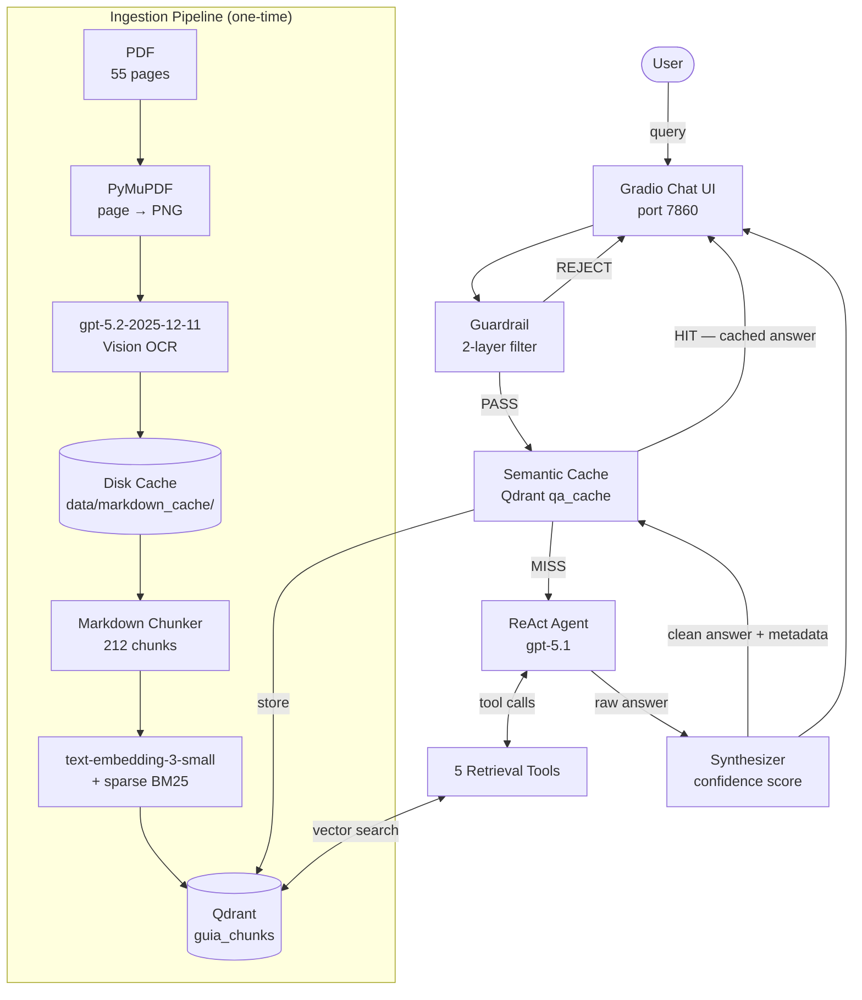
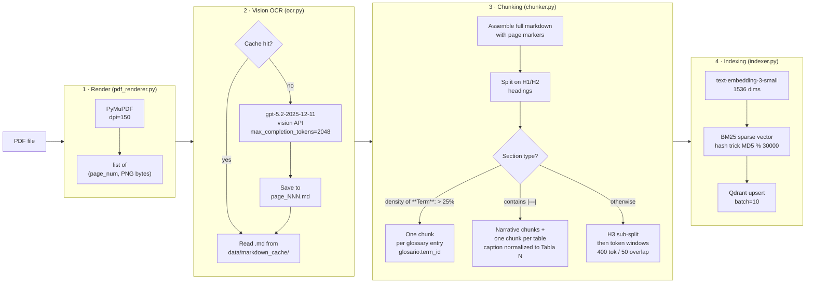
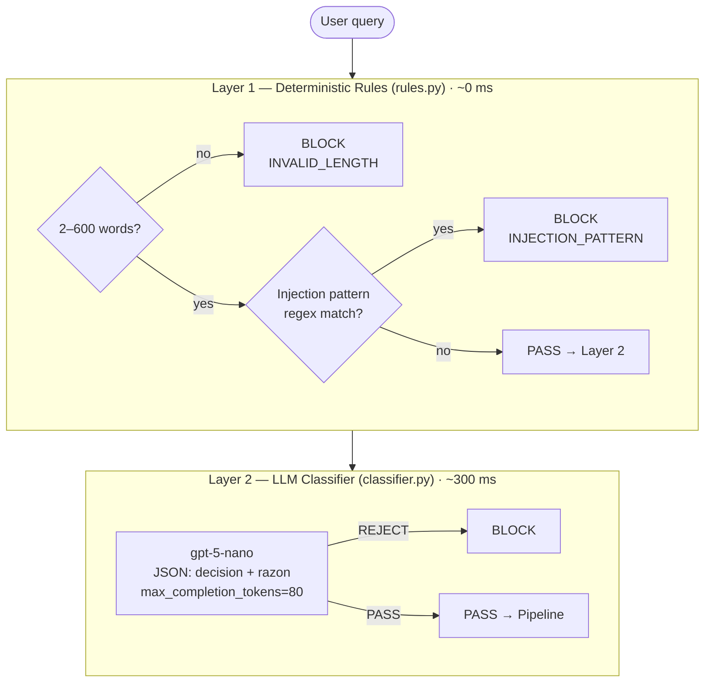
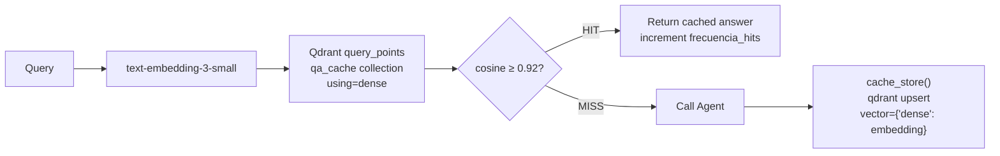
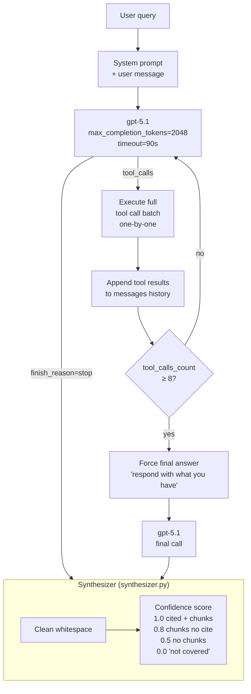
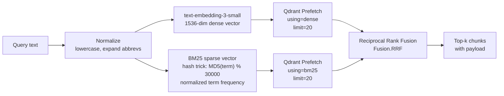
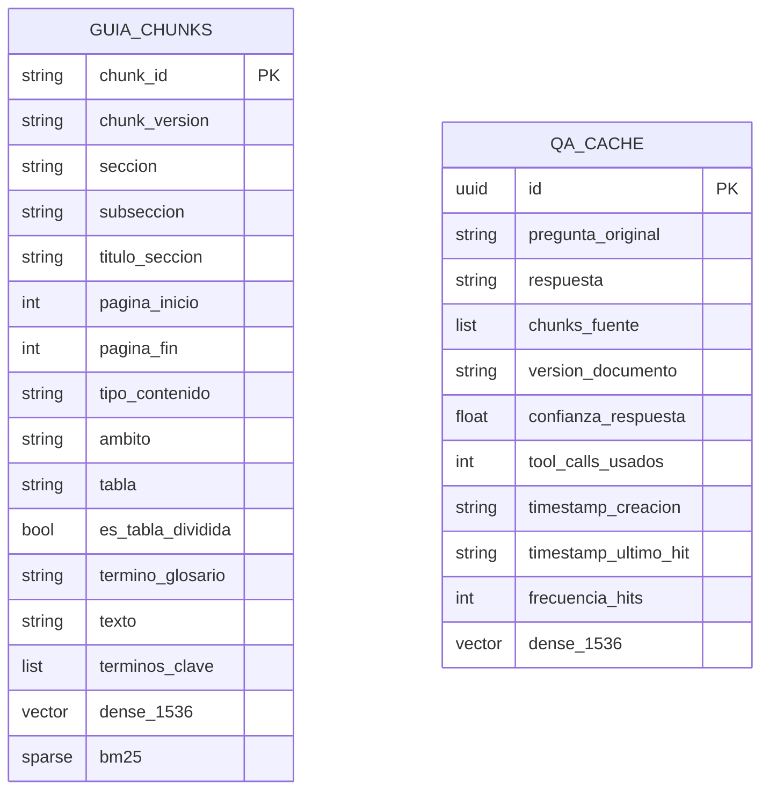

# Cyber-RAG — Asistente IA sobre la Guía Nacional de Ciberincidentes

Agentic RAG system over the **Guía Nacional de Notificación y Gestión de Ciberincidentes** (Consejo Nacional de Ciberseguridad, Spain, 2020). Ask questions about incident classification, notification deadlines, responsible authorities, procedures, and glossary terms — all grounded exclusively in the document.

---

## Overview

```
User question → Guardrail → Semantic Cache → ReAct Agent → Qdrant → Grounded answer
```

The system never answers from general knowledge. Every claim is backed by a retrieved chunk and cited with section and page number. If the information is not in the document, it says so explicitly.

---

## High-Level Architecture



---

## Ingestion Pipeline

The pipeline converts a PDF into a searchable vector index. It is run once; subsequent starts use the Qdrant volume and markdown cache — no API calls needed.



### Chunk metadata

Every chunk stored in Qdrant carries:

| Field | Description |
|---|---|
| `chunk_id` | Unique ID, e.g. `sec_6_1_0`, `glosario.ransomware` |
| `seccion` | Structural number: `"6"`, `"6.1"`, `"A1"` |
| `subseccion` | Subsection number when applicable |
| `titulo_seccion` | Human-readable heading |
| `pagina_inicio / pagina_fin` | Page range in the PDF |
| `tipo_contenido` | `narrative`, `table`, `glossary_term`, `procedure`, `criteria_list`, `legal_reference` |
| `tabla` | Normalized caption `"Tabla N"` for table chunks |
| `termino_glosario` | Term string for glossary chunks |
| `ambito` | `general`, `sector_publico`, `infraestructuras_criticas`, … |
| `terminos_clave` | Top-8 keywords by frequency |

---

## Guardrail System

Every user message passes through a two-layer filter before reaching the agent. The guardrail is fail-open for ambiguous or off-topic questions — relevance filtering is the agent's job, not the guardrail's.



**Layer 1** checks 14 regex patterns (jailbreak keywords, prompt-injection tokens, system-prompt extraction attempts) and enforces a word-count range. Zero LLM cost.

**Layer 2** sends the query to `gpt-5-nano` with a strict system prompt that only detects manipulation attempts — not off-topic content. Returns only `PASS` or `REJECT`.

Both layers return the same opaque rejection message so as not to reveal which layer blocked the query.

---

## Semantic Cache

Before calling the (expensive) agent, the system checks whether a semantically similar question was already answered.



The cache collection (`qa_cache`) uses the same `text-embedding-3-small` embeddings as the main index. A threshold of **0.92** is conservative enough to avoid false hits on semantically close but distinct questions.

---

## ReAct Agent

The agent follows a **Reason → Act → Observe** loop using OpenAI tool calling. It has access to 5 retrieval tools and a maximum of 8 tool calls per query.



### Retrieval Tools

| Tool | When to use | Implementation |
|---|---|---|
| `hybrid_search` | Default first action for most queries | Dense + BM25 RRF fusion, optional section/type filters |
| `get_table` | Questions involving a numbered table | Scroll by `tabla == "Tabla N"` |
| `get_section` | Need full view of a section | Scroll by `seccion` or `subseccion` field |
| `get_context_window` | Need context around a specific chunk | Page-proximity search `±window` pages |
| `glossary_lookup` | Meaning of a technical term | Match/partial search on `termino_glosario` field |

### Hybrid Search



---

## Qdrant Collections



Both collections use **named vectors** (`vectors_config={"dense": VectorParams(...)}`). `guia_chunks` additionally has a sparse `bm25` named vector for hybrid search.

---

## Project Structure

```
cyber-rag/
├── data/
│   ├── guia_nacional_notificacion_gestion_ciberincidentes.pdf
│   └── markdown_cache/          # OCR cache — page_001.md … page_055.md
├── src/
│   ├── ingestion/
│   │   ├── pdf_renderer.py      # PDF → PNG pages (PyMuPDF)
│   │   ├── ocr.py               # PNG → Markdown (gpt-5.2 vision + disk cache)
│   │   ├── chunker.py           # Markdown → Chunk objects
│   │   └── indexer.py           # Orchestrator: OCR → chunk → embed → upsert
│   ├── retrieval/
│   │   └── qdrant_client.py     # 5 query types + hybrid search + sparse vector
│   ├── guardrail/
│   │   ├── __init__.py          # Unified guardrail() with timing logs
│   │   ├── rules.py             # Layer 1: regex + length
│   │   └── classifier.py        # Layer 2: gpt-5-nano PASS/REJECT
│   ├── cache/
│   │   └── semantic_cache.py    # Lookup + store + TTL invalidation
│   ├── agent/
│   │   ├── agent.py             # ReAct loop (gpt-5.1, max 8 tool calls)
│   │   ├── tools.py             # Tool definitions + execute_tool dispatcher
│   │   └── synthesizer.py       # Response cleanup + confidence score
│   └── ui/
│       └── app.py               # Gradio chat interface
├── docs/                        # Design documents
├── Dockerfile
├── docker-compose.yml
└── requirements.txt
```

---

## Stack

| Component | Technology |
|---|---|
| LLM — agent | `gpt-5.1` |
| LLM — OCR | `gpt-5.2-2025-12-11` (vision) |
| LLM — guardrail | `gpt-5-nano` |
| Embeddings | `text-embedding-3-small` (1536 dims) |
| Vector DB | Qdrant (dense + sparse named vectors) |
| PDF rendering | PyMuPDF |
| UI | Gradio 6 |
| Runtime | Python 3.11, Docker |

---

## Quick Start

**Prerequisites:** Docker, an OpenAI API key, and the PDF placed in `data/`.

```bash
# 1. Clone and configure
cp .env.example .env
# Edit .env and set OPENAI_API_KEY=sk-...

# 2. Place the PDF
# data/guia_nacional_notificacion_gestion_ciberincidentes.pdf

# 3. First run — ingests the document (OCR + embed, ~5 min first time)
docker compose up --build

# 4. Subsequent starts — uses cached markdown and Qdrant volume (instant)
docker compose up

# UI available at http://localhost:7860
```

### Environment Variables

| Variable | Default | Description |
|---|---|---|
| `OPENAI_API_KEY` | — | **Required** |
| `PDF_PATH` | `data/guia_nacional_notificacion_gestion_ciberincidentes.pdf` | Path to source PDF |
| `OCR_MODEL` | `gpt-5.2-2025-12-11` | Vision model for OCR |
| `OCR_CONCURRENCY` | `5` | Parallel OCR requests |
| `MARKDOWN_CACHE_DIR` | `data/markdown_cache` | OCR cache directory |
| `QDRANT_HOST` | `localhost` | Qdrant hostname |
| `QDRANT_PORT` | `6333` | Qdrant port |

### Re-ingesting

The OCR cache means only the embedding API is called on re-ingest:

```bash
# Full re-ingest (re-embeds all chunks, resets Qdrant collection)
docker compose run --rm ingest

# Force re-OCR of all pages (delete cache first)
rm -rf data/markdown_cache/
docker compose run --rm ingest
```
