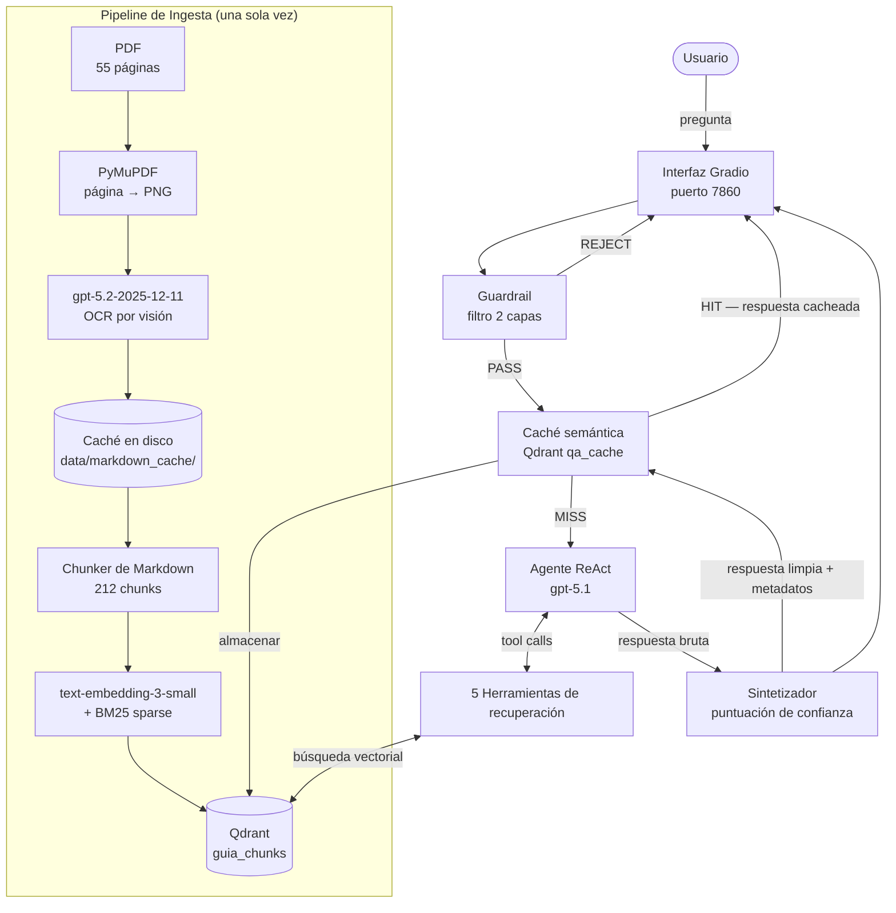
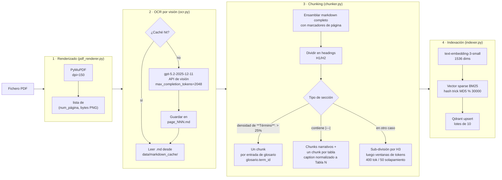
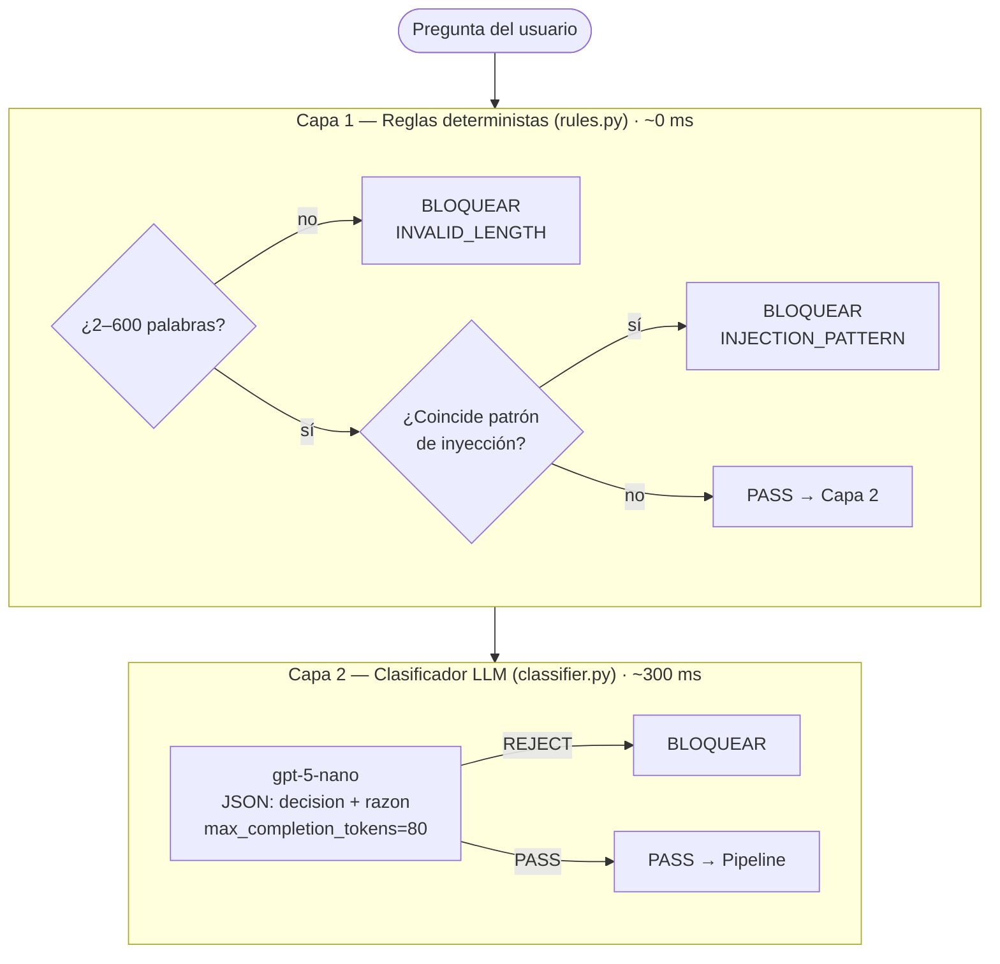
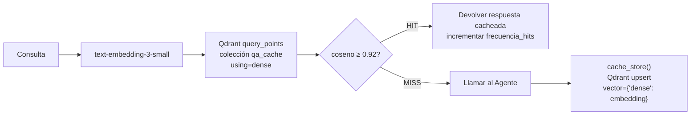
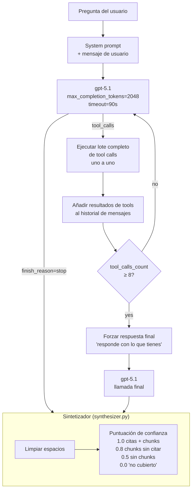
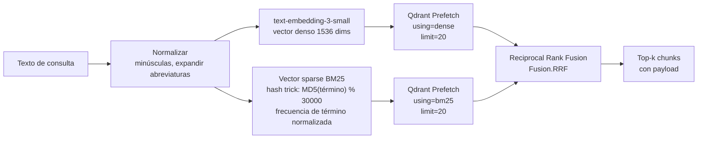
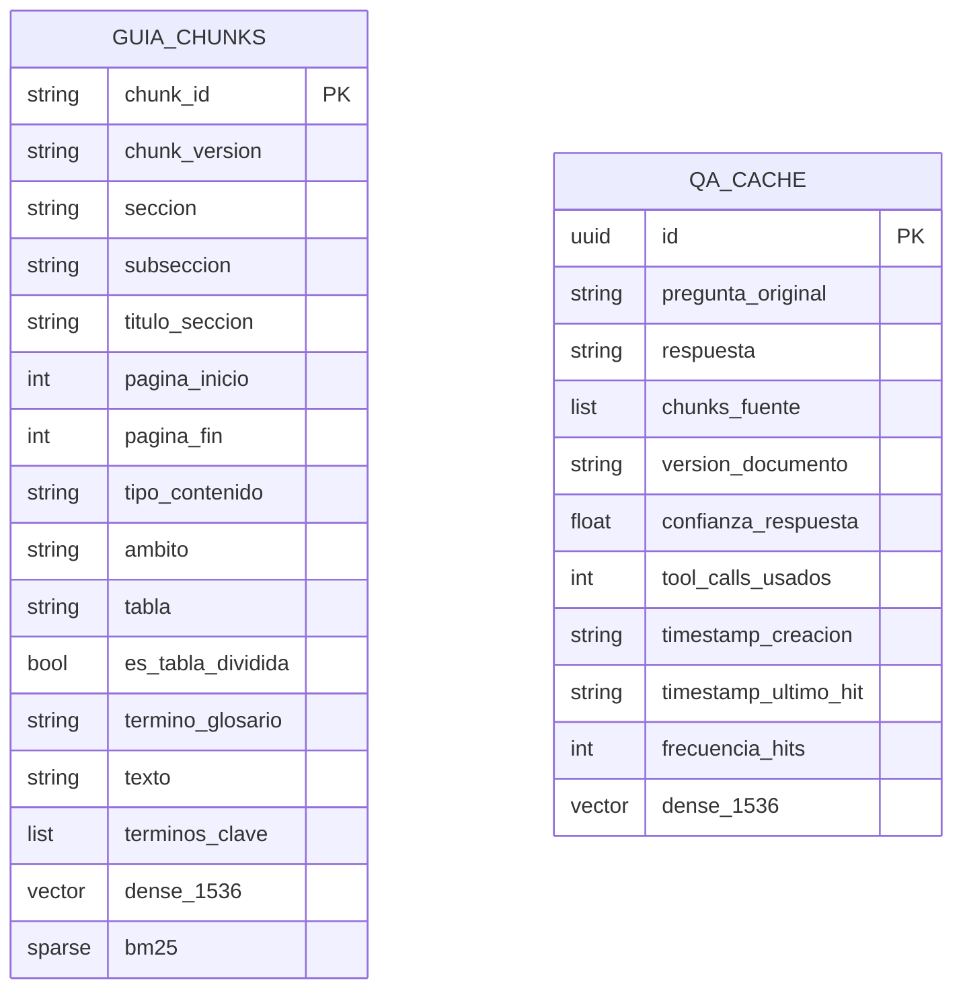

# Cyber-RAG — Asistente IA sobre la Guía Nacional de Ciberincidentes

Sistema RAG agéntico sobre la **Guía Nacional de Notificación y Gestión de Ciberincidentes** (Consejo Nacional de Ciberseguridad, 2020). Permite consultar clasificación de incidentes, plazos de notificación, organismos responsables, procedimientos y términos del glosario, con respuestas fundamentadas exclusivamente en el documento.

---

## Descripción general

```
Pregunta del usuario → Guardrail → Caché semántica → Agente ReAct → Qdrant → Respuesta fundamentada
```

El sistema nunca responde desde conocimiento general. Cada afirmación está respaldada por un fragmento recuperado y citada con sección y número de página. Si la información no está en el documento, lo indica explícitamente.

---

## Arquitectura general



---

## Pipeline de ingesta

El pipeline convierte el PDF en un índice vectorial consultable. Se ejecuta una sola vez; los arranques posteriores usan el volumen de Qdrant y la caché de markdown sin ninguna llamada a la API.



### Metadatos de cada chunk

Cada chunk almacenado en Qdrant incluye:

| Campo | Descripción |
|---|---|
| `chunk_id` | ID único, p. ej. `sec_6_1_0`, `glosario.ransomware` |
| `seccion` | Número estructural: `"6"`, `"6.1"`, `"A1"` |
| `subseccion` | Número de subsección cuando aplica |
| `titulo_seccion` | Encabezado legible por humanos |
| `pagina_inicio / pagina_fin` | Rango de páginas en el PDF |
| `tipo_contenido` | `narrative`, `table`, `glossary_term`, `procedure`, `criteria_list`, `legal_reference` |
| `tabla` | Caption normalizado `"Tabla N"` para chunks de tabla |
| `termino_glosario` | Término para chunks de glosario |
| `ambito` | `general`, `sector_publico`, `infraestructuras_criticas`, … |
| `terminos_clave` | Top-8 palabras clave por frecuencia |

---

## Sistema de Guardrail

Cada mensaje del usuario pasa por un filtro de dos capas antes de llegar al agente. El guardrail es permisivo ante preguntas ambiguas o fuera de tema — filtrar por relevancia es tarea del agente, no del guardrail.



**Capa 1** comprueba 14 patrones regex (palabras clave de jailbreak, tokens de prompt-injection, intentos de extracción del system prompt) y valida el rango de longitud. Coste cero de LLM.

**Capa 2** envía la consulta a `gpt-5-nano` con un system prompt estricto que solo detecta intentos de manipulación, no contenido fuera de tema. Devuelve únicamente `PASS` o `REJECT`.

Ambas capas devuelven el mismo mensaje de rechazo opaco para no revelar qué capa bloqueó la consulta.

---

## Caché semántica

Antes de invocar al agente (costoso), el sistema comprueba si una pregunta semánticamente similar ya fue respondida.



La colección de caché (`qa_cache`) usa los mismos embeddings `text-embedding-3-small` que el índice principal. Un umbral de **0.92** es suficientemente conservador para evitar falsos aciertos en preguntas semánticamente próximas pero distintas.

---

## Agente ReAct

El agente sigue un bucle **Razonar → Actuar → Observar** usando tool calling de OpenAI. Dispone de 5 herramientas de recuperación y un máximo de 8 llamadas a herramientas por consulta.



### Herramientas de recuperación

| Herramienta | Cuándo usarla | Implementación |
|---|---|---|
| `hybrid_search` | Primera acción por defecto en la mayoría de consultas | Fusión RRF dense + BM25, filtros opcionales de sección/tipo |
| `get_table` | Preguntas que involucran una tabla numerada | Scroll por `tabla == "Tabla N"` |
| `get_section` | Vista completa de una sección | Scroll por campo `seccion` o `subseccion` |
| `get_context_window` | Contexto alrededor de un chunk específico | Búsqueda por proximidad de página `±window` páginas |
| `glossary_lookup` | Significado de un término técnico | Búsqueda exacta/parcial en campo `termino_glosario` |

### Búsqueda híbrida



---

## Colecciones de Qdrant



Ambas colecciones usan **vectores con nombre** (`vectors_config={"dense": VectorParams(...)}`). `guia_chunks` incorpora además un vector sparse `bm25` para la búsqueda híbrida.

---

## Estructura del proyecto

```
cyber-rag/
├── data/
│   ├── guia_nacional_notificacion_gestion_ciberincidentes.pdf
│   └── markdown_cache/          # Caché OCR — page_001.md … page_055.md
├── src/
│   ├── ingestion/
│   │   ├── pdf_renderer.py      # PDF → páginas PNG (PyMuPDF)
│   │   ├── ocr.py               # PNG → Markdown (gpt-5.2 visión + caché disco)
│   │   ├── chunker.py           # Markdown → objetos Chunk
│   │   └── indexer.py           # Orquestador: OCR → chunk → embed → upsert
│   ├── retrieval/
│   │   └── qdrant_client.py     # 5 tipos de consulta + búsqueda híbrida + vector sparse
│   ├── guardrail/
│   │   ├── __init__.py          # guardrail() unificado con logs de timing
│   │   ├── rules.py             # Capa 1: regex + longitud
│   │   └── classifier.py        # Capa 2: gpt-5-nano PASS/REJECT
│   ├── cache/
│   │   └── semantic_cache.py    # Lookup + almacenamiento + invalidación por TTL
│   ├── agent/
│   │   ├── agent.py             # Bucle ReAct (gpt-5.1, máx. 8 tool calls)
│   │   ├── tools.py             # Definiciones de tools + despachador execute_tool
│   │   └── synthesizer.py       # Limpieza de respuesta + puntuación de confianza
│   └── ui/
│       └── app.py               # Interfaz de chat Gradio
├── docs/                        # Documentos de diseño
├── Dockerfile
├── docker-compose.yml
└── requirements.txt
```

---

## Tecnologías

| Componente | Tecnología |
|---|---|
| LLM — agente | `gpt-5.1` |
| LLM — OCR | `gpt-5.2-2025-12-11` (visión) |
| LLM — guardrail | `gpt-5-nano` |
| Embeddings | `text-embedding-3-small` (1536 dims) |
| Base de datos vectorial | Qdrant (vectores densos + sparse con nombre) |
| Renderizado de PDF | PyMuPDF |
| Interfaz de usuario | Gradio 6 |
| Entorno de ejecución | Python 3.11, Docker |

---

## Diario de desarrollo

El proceso de diseño y resolución está documentado en [`DEVLOG.md`](DEVLOG.md).

---

## Inicio rápido

**Requisitos previos:** Docker, una clave de API de OpenAI y el PDF en `data/`.

```bash
# 1. Configurar credenciales
cp .env.example .env
# Editar .env y establecer OPENAI_API_KEY=sk-...

# 2. Colocar el PDF
# data/guia_nacional_notificacion_gestion_ciberincidentes.pdf

# 3. Primera ejecución — ingesta el documento (OCR + embeddings, ~5 min la primera vez)
docker compose up --build

# 4. Arranques posteriores — usa la caché de markdown y el volumen de Qdrant (instantáneo)
docker compose up

# Interfaz disponible en http://localhost:7860
```

### Variables de entorno

| Variable | Por defecto | Descripción |
|---|---|---|
| `OPENAI_API_KEY` | — | **Obligatoria** |
| `PDF_PATH` | `data/guia_nacional_notificacion_gestion_ciberincidentes.pdf` | Ruta al PDF fuente |
| `OCR_MODEL` | `gpt-5.2-2025-12-11` | Modelo de visión para OCR |
| `OCR_CONCURRENCY` | `5` | Peticiones OCR en paralelo |
| `MARKDOWN_CACHE_DIR` | `data/markdown_cache` | Directorio de caché OCR |
| `QDRANT_HOST` | `localhost` | Hostname de Qdrant |
| `QDRANT_PORT` | `6333` | Puerto de Qdrant |

### Re-ingesta

La caché OCR hace que en una re-ingesta solo se llame a la API de embeddings:

```bash
# Re-ingesta completa (re-embebe todos los chunks, reinicia la colección Qdrant)
docker compose run --rm ingest

# Forzar re-OCR de todas las páginas (borrar caché primero)
rm -rf data/markdown_cache/
docker compose run --rm ingest
```
